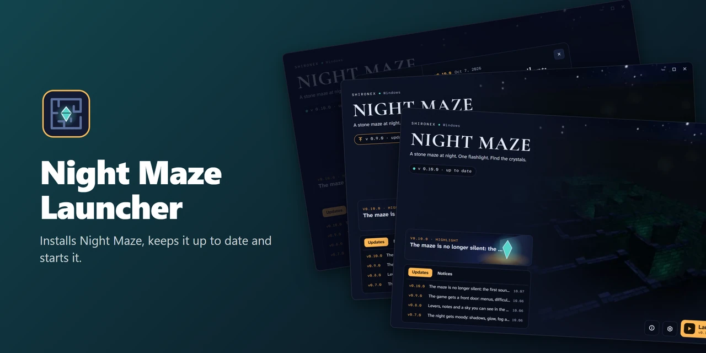
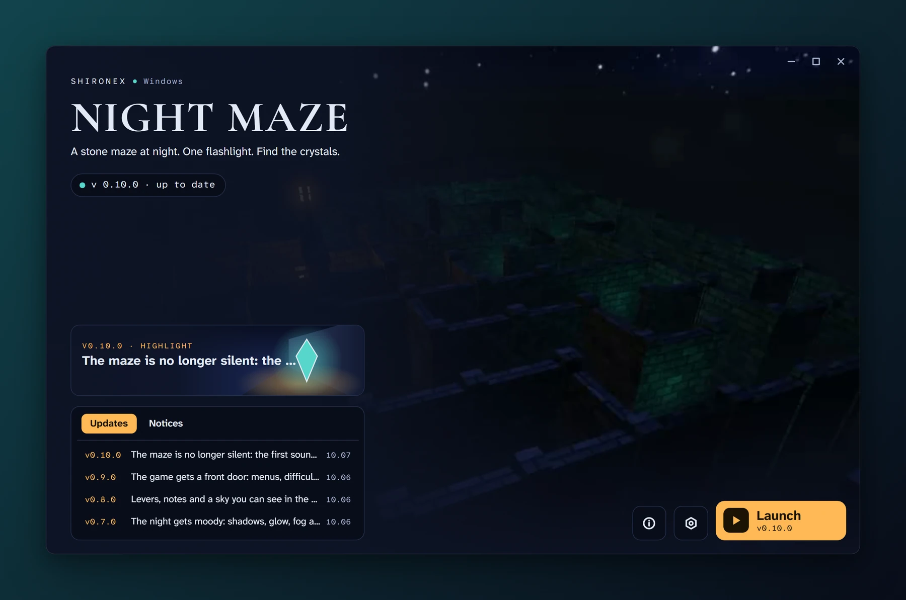
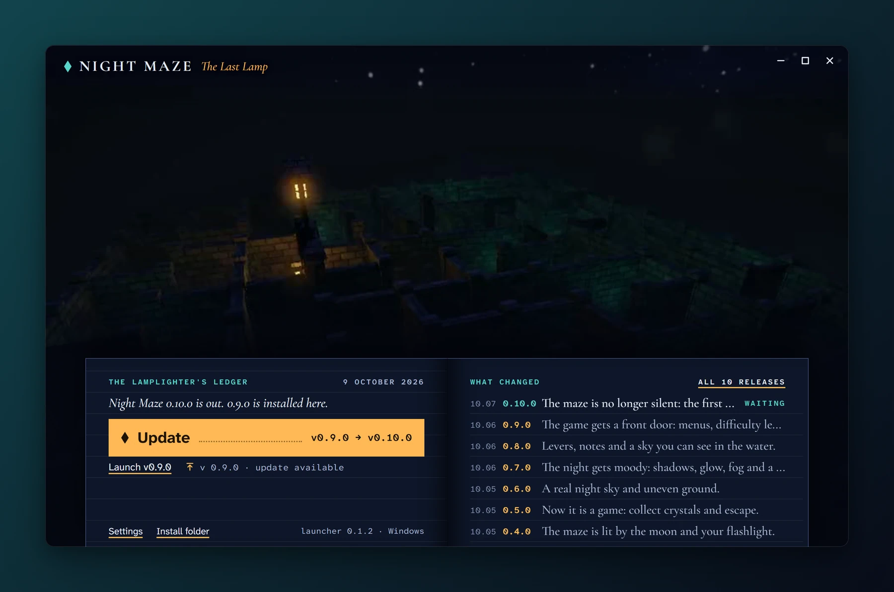
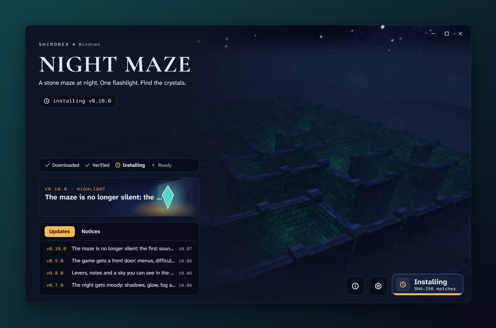
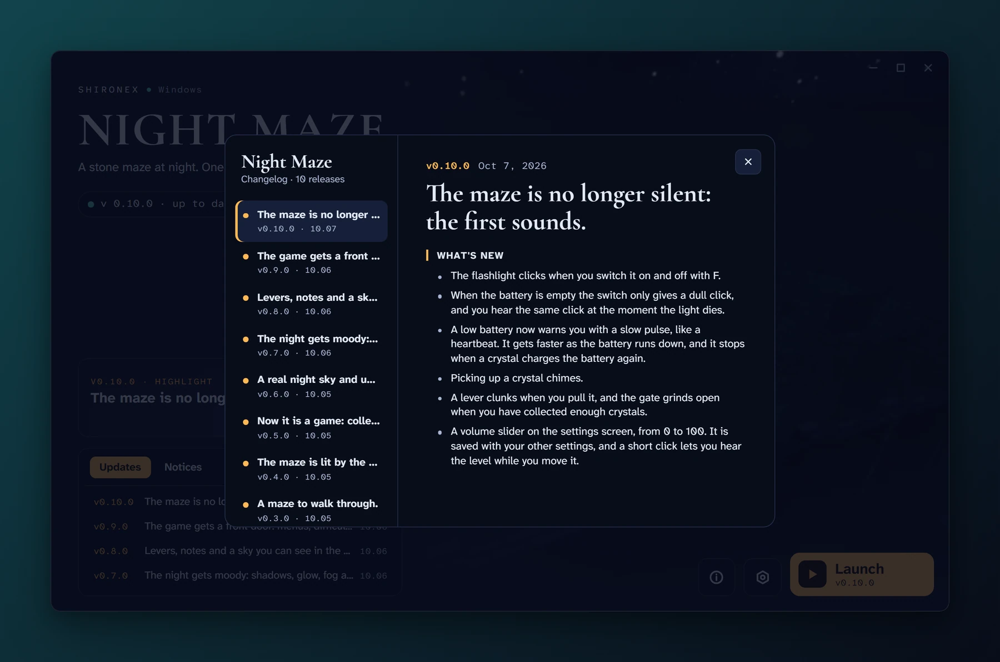
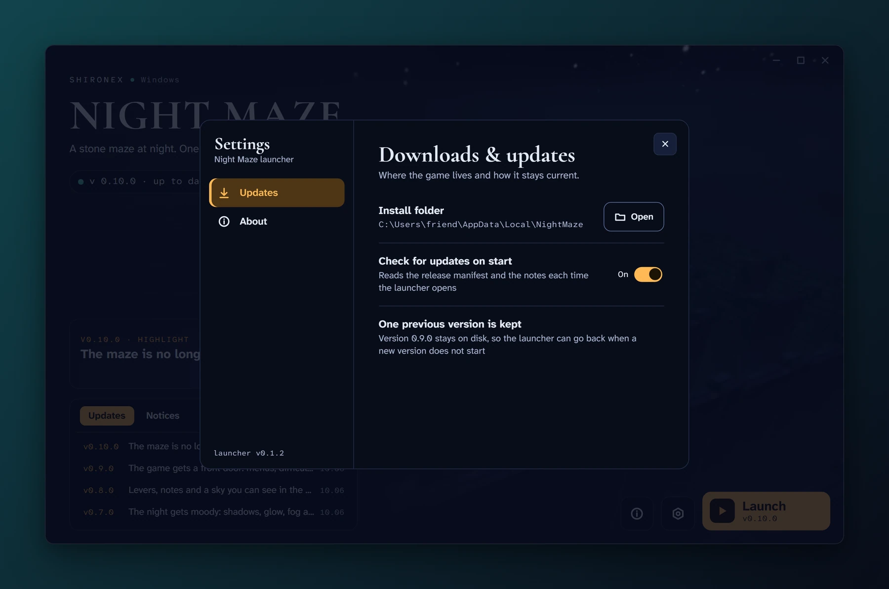
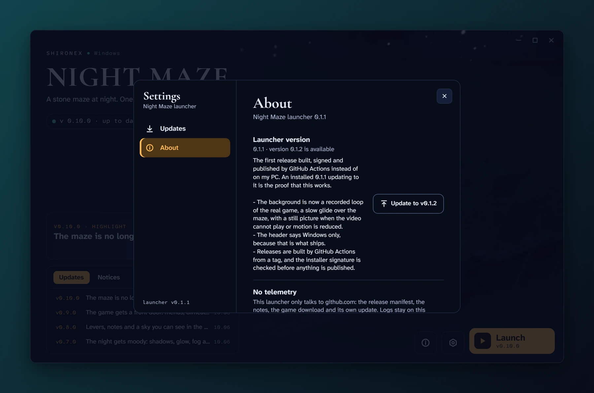
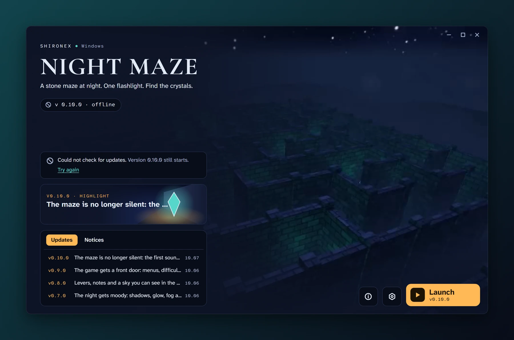

<div align="center">



<h1>Night Maze Launcher</h1>

**A small desktop program that installs Night Maze, keeps it up to date and starts it.**

[](https://github.com/Shironex/night-maze-launcher/releases/latest)
[](https://github.com/Shironex/night-maze-launcher/actions/workflows/ci.yml)
[](LICENSE)

[Download](https://github.com/Shironex/night-maze-launcher/releases/latest) · [The game](https://github.com/Shironex/night-maze) · [Docs](docs/development.md) · [Changelog](CHANGELOG.md)

> For friends who want to play Night Maze without building it. They install the launcher once, and it downloads the game, keeps the game and itself up to date, and starts it.

</div>

> [!WARNING]
> This is a university project that I keep working on to learn OpenGL (for the game) and Tauri and Rust (for the launcher). It changes a lot, and things will break here and there. Expect rough edges and breaking changes between versions.

---

## What is Night Maze Launcher?

[Night Maze](https://github.com/Shironex/night-maze) is a small game I am writing: a stone maze at night, one flashlight, crystals to find. This launcher is the program a friend downloads to play it. It reads the newest game release from GitHub, installs it, shows what changed, and starts the game. When a newer version comes out it offers the update.

It is a Tauri 2 application. The rules (what to download, how to check it, when to go back a version) are a plain Rust library in `crates/core`. The window is React and TypeScript in `src`. `src-tauri` joins the two.

## Download

Get the installer from the [latest release](https://github.com/Shironex/night-maze-launcher/releases/latest). Windows 10 or 11, 64 bit, only for now.

The installer is not signed with a paid certificate, so Windows shows "Windows protected your PC". Click "More info", then "Run anyway".

Everything is installed per user, with no administrator rights.

What I have really tried: I have run the launcher by hand on one Windows 11 PC, and nowhere else. An install on a clean second machine has not been tried yet. [docs/development.md](docs/development.md#what-has-been-run-by-hand) lists what has been run and what has not.

## Screenshots

The window is the recorded loop of the game with an open ledger along the bottom. The left page says what is installed and holds the one main action, the right page lists the releases.

<table>
  <tr>
    <td width="50%"></td>
    <td width="50%"></td>
  </tr>
  <tr>
    <td align="center"><sub>Nothing is installed yet: one line downloads the newest game.</sub></td>
    <td align="center"><sub>The game is installed and up to date, with every release on the page beside it.</sub></td>
  </tr>
  <tr>
    <td width="50%"></td>
    <td width="50%"></td>
  </tr>
  <tr>
    <td align="center"><sub>A newer game version waits on the right page: update, or start the one you have.</sub></td>
    <td align="center"><sub>The download is checked and unpacked in steps.</sub></td>
  </tr>
  <tr>
    <td width="50%"></td>
    <td width="50%"></td>
  </tr>
  <tr>
    <td align="center"><sub>Every release of the game, with what changed in it.</sub></td>
    <td align="center"><sub>Where the game lives, and whether to look for updates on start.</sub></td>
  </tr>
  <tr>
    <td width="50%"></td>
    <td width="50%"></td>
  </tr>
  <tr>
    <td align="center"><sub>The launcher finds its own update and shows its notes under Settings, About.</sub></td>
    <td align="center"><sub>Without a network the installed game still starts.</sub></td>
  </tr>
</table>

The release notes in these pictures are the real ones of the game. The install folder is an invented one.

## What's inside

| Feature              | What it does                                                                                                                                                                                                                                                                                                                                                                          |
| -------------------- | ------------------------------------------------------------------------------------------------------------------------------------------------------------------------------------------------------------------------------------------------------------------------------------------------------------------------------------------------------------------------------------- |
| Install              | Downloads the zip of the newest game release, checks its size and SHA-256 against the signed release information, and unpacks it into its own version folder. A version folder appears complete or not at all.                                                                                                                                                                        |
| Release notes        | Shows the notes of every game release: one dated line each on the right page, newest on top, and a dialog with the full text. News and notices from the feed are shown too when there are any. The last notes read are kept on disk, so they are there without a network too.                                                                                                         |
| Game updates         | Looks for a newer game version on start (this can be switched off) and offers it. You can update, or start the version you have.                                                                                                                                                                                                                                                      |
| Going back a version | The previous version stays on disk. If a new version that has never run well here exits with an error within 15 seconds of its start, and the previous version has run well before, the launcher removes the new one, starts the previous one and says so. That new version is not installed again on that computer. A build that starts but only shows a black screen is not caught. |
| Offline              | Without a network the installed game still starts. Only the very first download needs a connection.                                                                                                                                                                                                                                                                                   |
| Launcher self update | The launcher looks for a newer launcher at start and every four hours while it stays open. When it finds one, a slip of paper that sticks out of the ledger names the version, and a line on the left page installs it. The same update is also under Settings, About, with its notes.                                                                                                |
| Per user install     | The installer needs no administrator rights. The game, its logs and the launcher's state live in one folder of the user, `%LOCALAPPDATA%\NightMaze`.                                                                                                                                                                                                                                  |
| Settings             | Open the install folder, switch the update check on start on or off, open the folder with the game log.                                                                                                                                                                                                                                                                               |

"Run well" means: the game exited with code 0, or it was still running after 15 seconds. The full rule is in [docs/development.md](docs/development.md#rollback).

## How it stays safe

- **Signed release information.** The game's `manifest.json` and `news.json` must carry a valid signature by one of two release keys whose public halves are built into the launcher. Without one, the manifest is refused and the notes are not shown.
- **Checked download.** The game zip is checked against the size and the SHA-256 in that signed manifest before it is unpacked. A zip entry that would be written outside its folder is refused.
- **Signed launcher updates.** A launcher installer is accepted only with a signature by a key built into the installed launcher, and the version recorded in the signature must match the version that was announced.
- **https only.** Every address has to be https, also after redirects. Plain http is accepted for a loopback address only, which is what local testing uses.
- **No telemetry.** The window makes no network requests: its content security policy allows none. The Rust side downloads the release files from GitHub (the game's manifest, notes and zip, and the launcher's own update) and uploads nothing. The requests for the game's files name the launcher and its version in the user agent.

The installer itself is not code signed, which is why Windows warns about it (see [Download](#download)). Where the keys are, what happens when one is lost, and what it means that one of them is stored as a GitHub secret is in the [Keys](docs/development.md#keys) section of the docs.

## Why this repository is separate

An installed launcher looks for its own updates at the latest release of this repository. The latest release of the [game repository](https://github.com/Shironex/night-maze) has to stay the newest game release, because the launcher reads the game's release information from there. If the launcher installers were released in the game repository, a launcher release would take over "latest" and break that address. So the installers have their own home here.

The source moved here from the `launcher/` folder of the game repository, with its history.

## Built with

| Part           | What                                                                                                                                                    |
| -------------- | ------------------------------------------------------------------------------------------------------------------------------------------------------- |
| Shell          | [Tauri](https://tauri.app) 2, with its updater and single instance plugins                                                                              |
| Core           | Rust, edition 2024, toolchain 1.97.1. HTTP with reqwest 0.13 on rustls and tokio, signatures with minisign-verify, SHA-256 with sha2, archives with zip |
| Window         | React 19, TypeScript 6, zustand 5 for state                                                                                                             |
| Styles         | Tailwind CSS 4                                                                                                                                          |
| Fonts          | Atkinson Hyperlegible Next, Atkinson Hyperlegible Mono and Cormorant Garamond, bundled through `@fontsource`                                            |
| Build          | Vite 8, pnpm 10                                                                                                                                         |
| Tests and lint | Vitest 5, the Node test runner for the scripts, `cargo test`, ESLint 10, Prettier 3, clippy and rustfmt                                                 |

## Development

You need Node 22, pnpm 10 (`corepack enable` gives the version `package.json` names), Rust (rustup installs the version `rust-toolchain.toml` pins) and, on Windows, the WebView2 runtime, which is part of Windows 11.

| Command                  | What it does                                                           |
| ------------------------ | ---------------------------------------------------------------------- |
| `pnpm install`           | Installs the dependencies                                              |
| `pnpm tauri dev`         | Starts the launcher in development                                     |
| `pnpm build`             | Typechecks the window and builds it into `dist/`                       |
| `pnpm lint`              | ESLint                                                                 |
| `pnpm format:check`      | Prettier                                                               |
| `pnpm test`              | The tests of the window: view logic, text helpers, every preview state |
| `pnpm test:scripts`      | The tests of the Node scripts                                          |
| `cargo test --workspace` | The Rust tests. Run `pnpm build` first: the shell embeds `dist/`       |

How to run it against a local test server, the Rust checks, the folder layout on disk and what has never been tried are in [docs/development.md](docs/development.md). The release files that the launcher and the game repository agree on are in [docs/contract.md](docs/contract.md).

## Showcase images

The pictures in this README are made with [@noctcore/showcase-kit](https://github.com/noctcore/showcase-kit), from `showcase.config.mjs`. One command rebuilds all of them:

```sh
pnpm showcase
```

It starts `pnpm dev` (the window only, no Rust build) and opens the window's built-in preview states in a headless Chromium at the real window size, 1280 x 800. Nothing is fetched: the release notes are a static copy of the game's published ones in `src/dev/preview-feed.ts`, which is not part of a release build. To get the same picture on every run it keeps the background video on its still picture, fixes the date in the header, switches transitions off, waits for every font, parks the mouse, pins the user agent and refuses every request that does not go to the dev server.

Chromium has to be downloaded once: `pnpm exec playwright install chromium`. I have only run this on Windows 11.

## Releases

A release starts with a tag `vX.Y.Z`. The workflow builds the installer, waits for my approval before it signs it, checks the signature, and publishes the installer with `latest.json`, the file installed launchers read. One release has been made this way so far, 0.1.2: GitHub Actions built and signed it after my approval, and I did the last publish step by hand, because the workflow looked for its draft before GitHub listed it. That lookup tries again now. The steps, and what to do when one fails, are in [docs/development.md](docs/development.md#releasing). What changed in each version is in the [changelog](CHANGELOG.md).

## Licence

MIT, see [LICENSE](LICENSE). The recorded game footage and the icons are not covered by it; the file says which.
